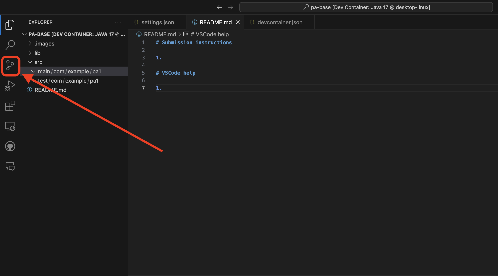
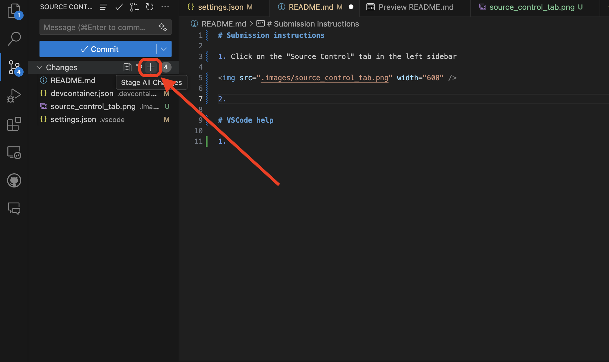
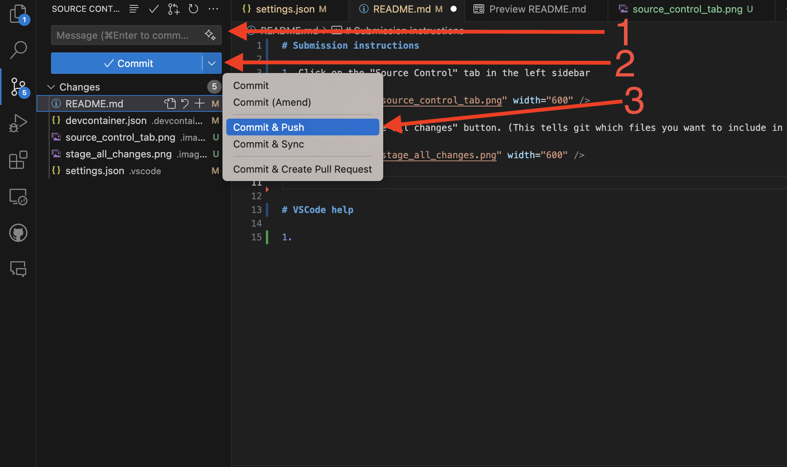
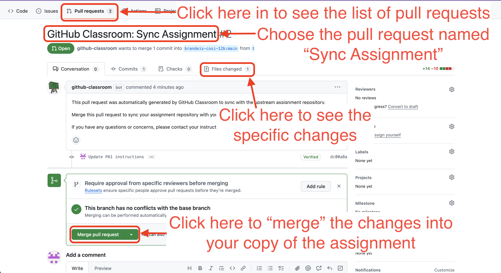
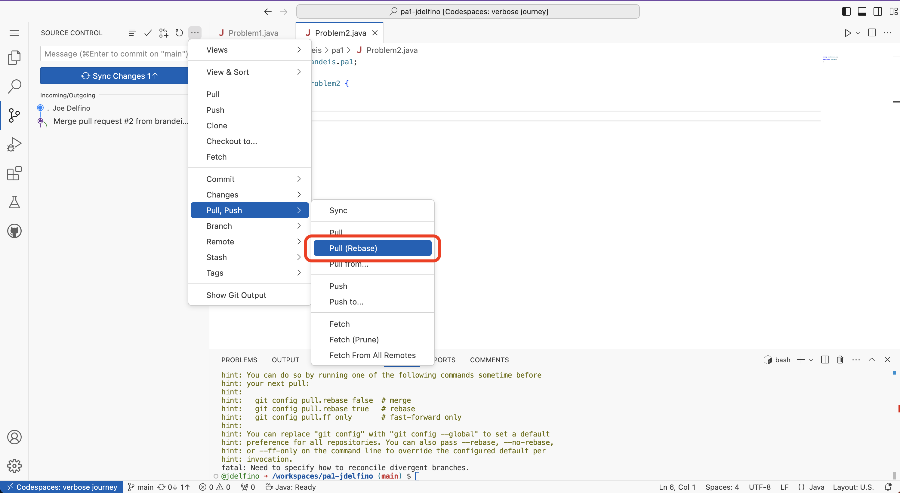
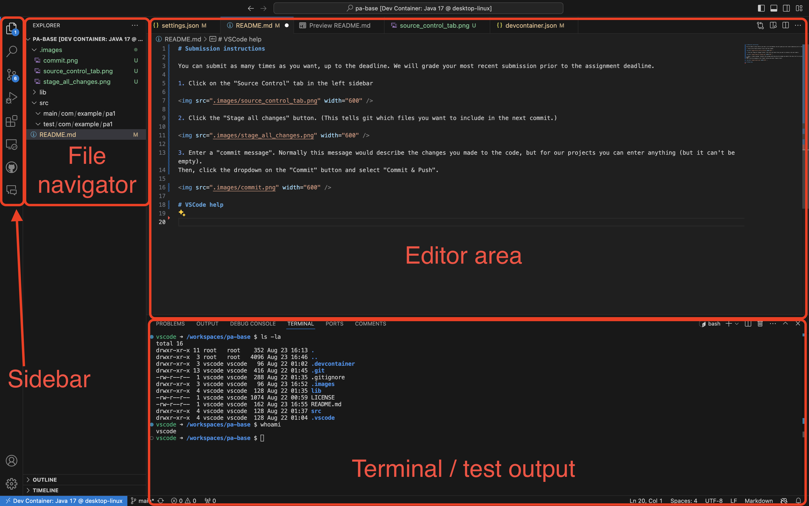
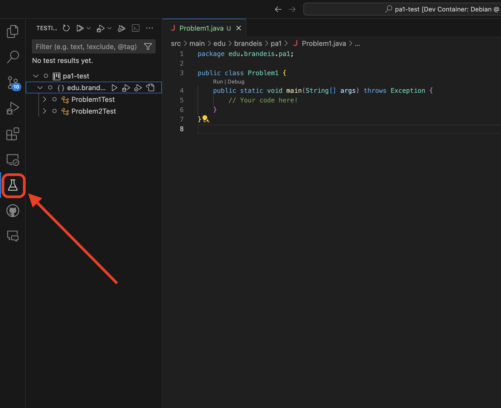
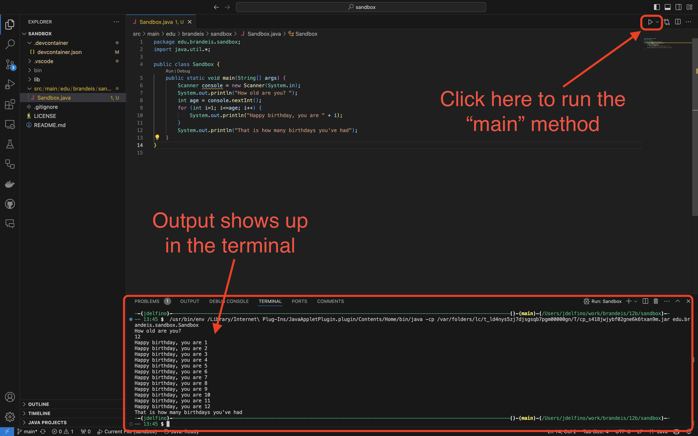

# Feeling stuck?

1. Review the assignment instructions and relevant lecture slides - there might be something you
missed or forgot!
1. Post to the "Ask the Class" forum with general questions. Do not paste any code into the public
forums.
1. If you are getting an error message, try searching online for the exact error message, there may
be resources to help point you in the right direction.
1. Attend office hours

# Working on assignments

First, accept the assignment by clicking on the link from Moodle. GitHub will create a copy of the starter
code and instructions for you.

You can then work on the code in one of two ways:

1. Codespaces (browser based editor)

You can use a browser-based version of VSCode to complete assignments, which means you
don't need VSCode, Docker, or git installed on your computer. This method uses a "Codespace": a cloud-based 
development environment provided by GitHub. 
  
<b>Note that you need an internet connection to develop like this.</b>
  
The PA instructions should have a link to open the assignment in a Codespace. 
  

Note that, with this method, all your changes are saved in the cloud. If you delete your Codespace before you 
submit, your changes are gone! 

 

2. Local VSCode

You can also develop locally on your computer. You will need an internet connection to check out the starter code,
but after that you can work offline.
  
<b>Do this once per PA:</b>
   <ol>
    <li>Open VSCode</li>
    <li>Open the command palette (Cmd-Shift-P / Ctrl-Shift-P), and type "Git: Clone", and select it. Paste in the URL
    to your repository (found from the GitHub Classroom assignment after you accept it).</li>
    <li>Choose a location on your computer to put the code.</li>
   </ol>
<b>Then each time you open the assignment:</b>
 
After the project opens, you should see a prompt in the lower right to "Reopen in container". Choose this.
If you don't see the prompt, you may not have Docker installed correctly, reach out to the course staff for help.

      
 

# Submission instructions

You can submit as many times as you want, up to the deadline. We will grade your most recent submission prior to the assignment deadline.

Expand to see instructions

1. Click on the "Source Control" tab in the left sidebar

2. Click the "Stage all changes" button. (This tells git which files you want to include in the next commit.)

3. Enter a "commit message". Normally this message would describe the changes you made to the code, but for our projects you can enter anything (but it can't be empty). 
Then, click the dropdown on the "Commit" button and select "Commit & Push".

 

# Getting updates to assignments

Occasionally, updates might need to be issued to assignments after you've accepted them. When this happens, 
it will be announced to the class. Follow the instructions below to incorporate the updates into your copy of
the assignment.

Expand to see instructions

To get the updates, follow these steps:
1. Merge the "Sync Assignment" pull request in your assignment repo
   1. Open the GitHub Classroom assignment link.
   1. Click on the link to your assignment repository (of the form: `https://github.com/brandeis-cosi-12b/pa<#>-<username>`)
   1. Click on "Pull requests" in the top bar
   1. Click on the "Sync Assignment" pull request.
   1. (Optional) Click on "Files changed" to see the specific changes
   1. Click on "Merge pull request", then confirm.

2. Pull the changes from GitHub down to your working directory (Codespace or local checkout).
   1. Open VSCode
   1. Commit any changes you have (see "Submission instructions" above). **The rest of these instructions will fail if you don't commit first**
   1. In VSCode, open the "Source control" tab from the left hand side panel.
   1. Choose "Pull" -> "Pull (rebase)"
   1. You should see the assignment updates in your code now.

 

# VSCode help

VSCode is a powerful Integrated Development Environment (IDE). It has many more features than you will need in this class, 
so it isn't important to explore or master everything. This section contains information on the parts you'll need to know throughout the course.

Expand to see details

Here are the main components of the screen:

Later in the course, assignments will include automated tests. These can be accessed from the testing tab on the left (it is only visible when tests exist).
You can run and debug tests with the various "play" buttons. Hover over them for more detail.

## Running code

When you have a Java file open which includes a `main` method, you will see a play button in the top right corner. If you click on it, it will run the `main` method.

 
